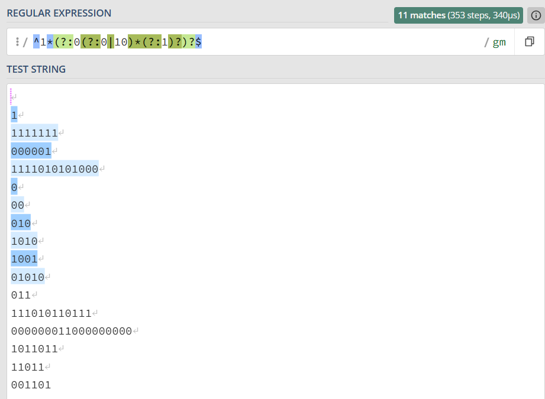

# Testes no regex101

**Regex usada:**  

```
^1*(?:0(?:0|10)*(?:1)?)?$
```

**Link do teste:**

```
https://regex101.com/r/TWf6hg/1
```

**Print do teste (strings válidas e inválidas no regex101):**  



---

## Exemplos do enunciado  

**Exemplos válidos:**  
- `1111111`  
- `000001`  
- `1111010101000`  

**Exemplos inválidos:**  
- `111010110111`  
- `011`  
- `000000011000000000`  


